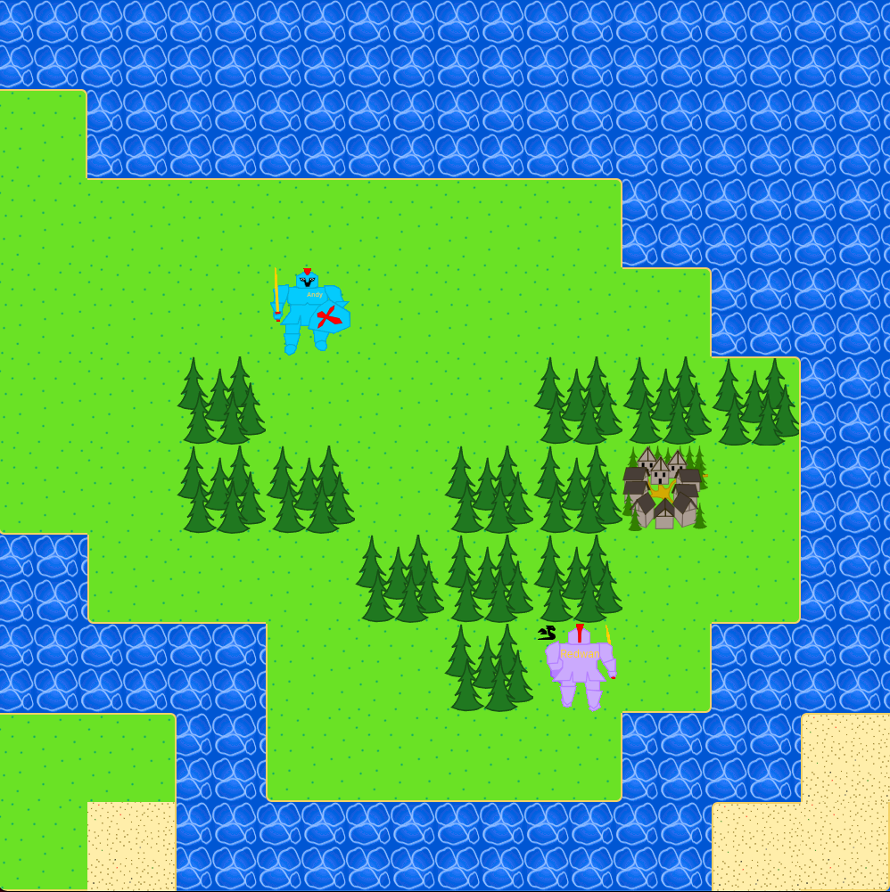
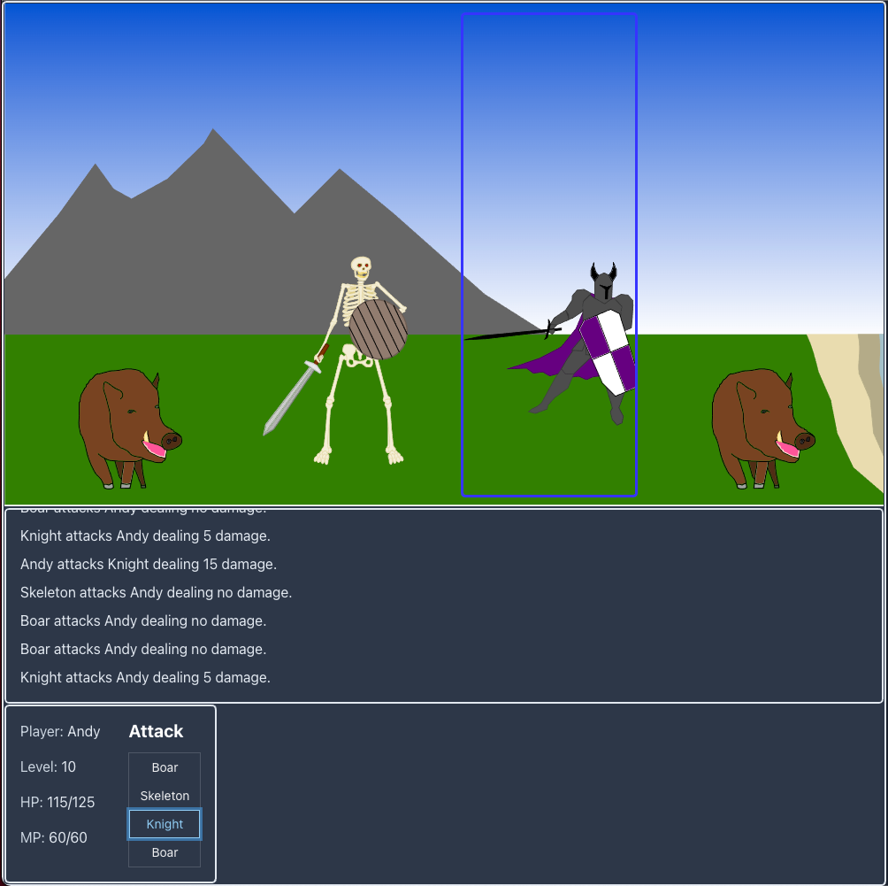
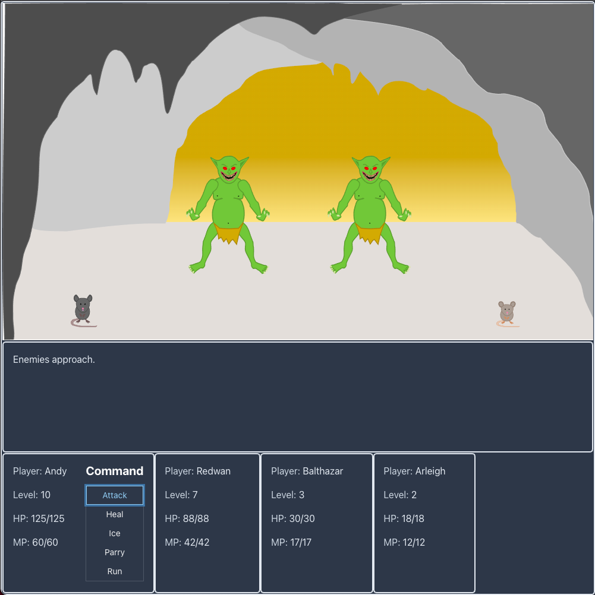
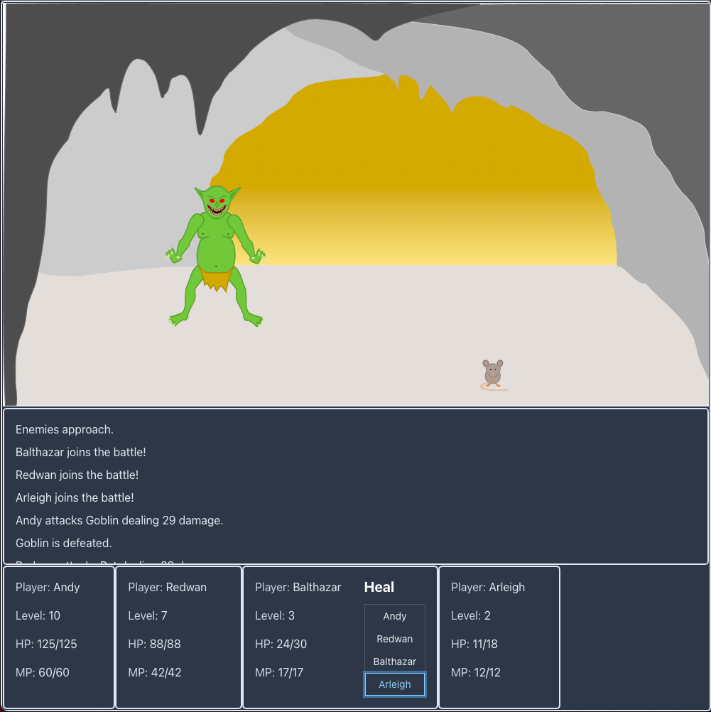

#Chronicles of Patrogonia
Chronicles of Patrogonia is a classic RPG where you gain experience and gold by defeating enemies in battle.

#

Adventure throughout the world of Patrogonia.

#

Battle foes on your own

#

or band together with other players.

#

Chronicles of Patrogonia is backed by a spring boot web service:
https://github.com/AndrewPatronite/patrogonia-service

#

For best results, visit the application with Chrome and a viewport set to 1000px x 1000px.

#

## Available Scripts

In the project directory, you can run:

### `npm run dev`
Runs the app in the development mode. 
Open [http://localhost:3000](http://localhost:3000) to view it in the browser.

### `npm run build`
Builds the app for production in the `build` folder.

### `npm start`
Runs the app

### `npm test`
### `npm run test:watch`
### `npm run test:watch-coverage`

Runs tests.

### `npm run lint`
Runs ESLint.
